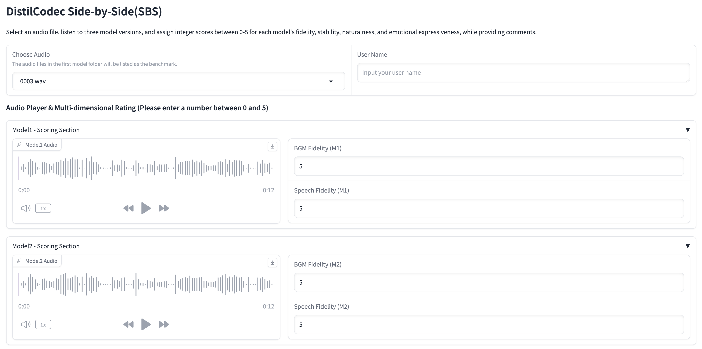

# DistilCodec
The Joint Laboratory of International Digital Economy Academy (IDEA) and Emdoor, in collaboration with Emdoor Information Technology Co., Ltd., has launched DistilCodec - A Single-Codebook Neural Audio Codec (NAC) with 32768 codes trained on uniersal audio.


[](https://arxiv.org/abs/2408.16532)
[](https://huggingface.co/IDEA-Emdoor/DistilCodec-v1.0)


# 🔥 News
- *2025.05.27*: We release DistilCodec-v1.0 checkpoint on [huggingface](https://huggingface.co/IDEA-Emdoor/DistilCodec-v1.0).
- *2025.05.26*: We release the code of DistilCodec-v1.0, including training and inference.
- *2025.05.22*: We release UniTTS and DistilCodec on [arxiv](https://arxiv.org/abs/2408.16532).

## Introduction of DistilCodec
The foundational network architecture of DistilCodec adopts an Encoder-VQ-Decoder framework
similar to that proposed in Soundstream. The encoder employs a ConvNeXt-V2 structure,
while the vector quantization module implements the GRFVQ scheme. The decoder
employs a ConvTranspose1d based architectural configuration similar to HiFiGAN. Detailed
network specifications and layer configurations are provided in Appendix A.1 The training methodol-
ogy of DistilCodec follows a similar approach to HiFiGAN, incorporating three types of
discriminators: Multi-Period Discriminator (MPD), Multi-Scale Discriminator (MSD), and Multi-
STFT Discriminator (MSFTFD). Here is the architecture of Distilcodec:


### Training Schema
We have developed a novel distillation approach termed DMS (**D**istilling **M**ulti-Codebook NAC to **S**ingle-Codebook NAC) by enabling the Student NAC to inherit encoder and decoder parameters from the Teacher NAC. Based on DMS, we trained DistilCodec using universal audio datasets as training data, achieving a single codebook with a codebook size of 32,768 while maintaining codebook utilization approaching 100\%. Simultaneously, the DMS algorithm enables the dimension of the distilled Student NAC Codebook to be scaled beyond 2048. Leveraging this capability, we configured the codebook dimension to 3584, aligning with the word embedding dimension of QWen2.5-7B (3584), so we subsequently leveraged DistilCodec's codebook to initialize the audio embedding layer in [UniTTS](https://github.com/IDEA-Emdoor-Lab/UniTTS). Here is the psuedo code of DMS:
#### Algorithm DMS: Distilling Multi-Codebook NAC to Single-Codebook NAC via parameter inheritance
1. **Step 1:** Initializing *Teacher codec*:
   
2. **Step 2:** *Teacher codec* training with LSGAN
3. **Step 3:** Initializing *Student codec*:
   
4. **Step 4:** *Student codec* training with DLF
5. **Output:** DistilCodec = Student_codec

The parameter settings for the codebooks of Teacher Codec and Student Codec are as follows, where N-Residual indicates the number of residual layers, N-Group denotes the number of groups, N-Codes/Codebook represents the number of codes per codebook, and Dimension specifies the dimension of the codebook.
| Codec       | N-Residual | N-Group | N-Codes/Codebook | Dimension |
|-------------|------------|---------|------------------|-----------|
| Teacher-Codec | 8          | 4       | 1024             | 512       |
| Student-Codec | 1          | 1       | 32768            | 3584      |

### Evaluation and Demos
The second row of the table demonstrates the codebook utilization and perplexity (PPL) of DistilCodec evaluated on LibriSpeech-Test-Clean. Given DistilCodec's capability to process universal audio, we have constructed an integrated test set comprising speech, audiobook, and music samples for evaluating codebook utilization and PPL in universal audio scenarios. As shown in the table, DistilCodec achieves near-optimal codebook utilization (approaching 100%) across both datasets, accompanied by notably high PPL values (the theoretical maximum PPL equals the codebook size, which is 32,768). These results substantiate DistilCodec's superior audio reconstruction capabilities in universal audio applications.
| Dataset              | Codebook Usage(%)↑ | Codebook PPL↑ |
|-----------------------|---------------------|---------------|
| LibriSpeech-Clean-Test| 98.2                | 21660.5       |
| Universal-Audio-Test  | 99.9                | 26999.0       |

Additionally, we conducted a comprehensive comparative analysis of DistilCodec’s speech reconstruction capabilities using the LibriSpeech-Clean-Test benchmark. 
| Model             | Codebook Size | Nq | Token Rate (TPS) | Bandwidth (bps) | STOI ↑ | PESQ ↑ | UTMOS ↑ |
|-------------------|---------------|----|------------------|----------------|--------|--------|--------|
| Encodec           | 1024          | 8  | 600              | 6000           | 0.94   | 2.75   | 3.07   |
| DAC               | 1024          | 12 | 600              | 6000           | 0.95   | 4.01   | 4.00   |
| Encodec           | 1024          | 2  | 150              | 1500           | 0.84   | 1.56   | 1.58   |
| Mimi              | 2048          | 8  | 100              | 1100           | 0.91   | 2.25   | 3.56   |
| BigCodec          | 8192          | 1  | 80               | 1040           | 0.94   | 2.68   | 4.11   |
| DAC               | 1024          | 2  | 100              | 1000           | 0.73   | 1.14   | 1.29   |
| SpeechTokenizer   | 1024          | 2  | 100              | 1000           | 0.77   | 1.25   | 2.28   |
| X-codec           | 1024          | 2  | 100              | 1000           | 0.86   | 2.33   | 4.21   |
| WavTokenizer      | 4096          | 1  | 75               | 900            | 0.89   | 2.14   | 3.94   |
| X-codec2          | 65536         | 1  | 50               | 800            | 0.92   | 2.43   | 4.13   |
| StableCodec       | 15625         | 2  | 50               | 697            | 0.91   | 2.24   | 4.23   |
| Single-Codec      | 8192          | 1  | 23.4             | 304            | 0.86   | 1.88   | 3.72   |
| BiCodec           | 8192          | 1  | 50               | 650            | 0.92   | 2.51   | 4.18   |
| DistilCodec       | 32768         | 1  | 93               | 1300           | 0.93   | 2.02   | 3.75   |

Since DistilCodec was trained on universal audio, we first employed UTMOS for automatic quality assessment. However, the universal audio test set received an unreliable low score (1.89), indicating UTMOS's inadequacy for universal audio evaluation. We therefore conducted a Mean Opinion Score (MOS) evaluation, the results are shown:
| Assessment Items          | Reconstructed | Original    |
|---------------------------|------------------|-------|
| Speech Clarity            | 4.689            | 4.945 |
| Background Audio Clarity  | 4.768            | 4.927 |
| Average Score             | 4.728            | 4.4936|

The MOS evaluation dataset comprises original audio samples stored in the [Original Audios](./data/org_audios/) directory and corresponding reconstructed samples generated by DistilCodec in the [Reconstructed Audios](./data/gen_audios). Below are comparative analyses between selected original and reconstructed audio pairs:
| Category        | Original Audio | Reconstructed Aduio   |
|---------------------------|------------------|-------|
| Chinese Audio    |[Audio1](./data/org_audios/0b0c96e3-e2ae-45a3-9488-806cd719517b_0175.wav)|<audio controls src="./data/gen_audios/0b0c96e3-e2ae-45a3-9488-806cd719517b_0175.wav">Your browser does not support audio playback. Please download <a href="./data/gen_audios/0b0c96e3-e2ae-45a3-9488-806cd719517b_0175.wav">audio file</a>。</audio>|
| Chinese Audio    |<audio controls src="./data/org_audios/0d28f03f-70c8-4180-ba1c-37b167aa9447_0074.wav">Your browser does not support audio playback. Please download <a href="./data/org_audios/0d28f03f-70c8-4180-ba1c-37b167aa9447_0074.wav">audio file</a>。</audio>|<audio controls src="./data/gen_audios/0d28f03f-70c8-4180-ba1c-37b167aa9447_0074.wav">Your browser does not support audio playback. Please download <a href="./data/gen_audios/0d28f03f-70c8-4180-ba1c-37b167aa9447_0074.wav">audio file</a>。</audio>|
| Chinese Audio    |<audio controls src="./data/org_audios/0eff38a1-3c9c-4a33-9be9-896614417d3f_0081.wav">Your browser does not support audio playback. Please download <a href="./data/org_audios/0eff38a1-3c9c-4a33-9be9-896614417d3f_0081.wav">audio file</a>。</audio>|<audio controls src="./data/gen_audios/0eff38a1-3c9c-4a33-9be9-896614417d3f_0081.wav">Your browser does not support audio playback. Please download <a href="./data/gen_audios/0eff38a1-3c9c-4a33-9be9-896614417d3f_0081.wav">audio file</a>。</audio>|
| English Audio    |<audio controls src="./data/org_audios/f0b1da30-ad19-4619-8aee-4b5c6d8c4acf_POD0000003287_S0000341.wav">Your browser does not support audio playback. Please download <a href="./data/org_audios/f0b1da30-ad19-4619-8aee-4b5c6d8c4acf_POD0000003287_S0000341.wav">audio file</a>。</audio>|<audio controls src="./data/gen_audios/f0b1da30-ad19-4619-8aee-4b5c6d8c4acf_POD0000003287_S0000341.wav">Your browser does not support audio playback. Please download <a href="./data/gen_audios/f0b1da30-ad19-4619-8aee-4b5c6d8c4acf_POD0000003287_S0000341.wav">audio file</a>。</audio>|
| English Audio    |<audio controls src="./data/org_audios/0016.wav">Your browser does not support audio playback. Please download <a href="./data/org_audios/0016.wav">audio file</a>。</audio>|<audio controls src="./data/gen_audios/0016.wav">Your browser does not support audio playback. Please download <a href="./data/gen_audios/0016.wav">audio file</a>。</audio>|
| English Audio    |<audio controls src="./data/org_audios/2f7f51c9-c514-4a23-8c31-d032c929df46_YOU0000006574_S0000379.wav">Your browser does not support audio playback. Please download <a href="./data/org_audios/2f7f51c9-c514-4a23-8c31-d032c929df46_YOU0000006574_S0000379.wav">audio file</a>。</audio>|<audio controls src="./data/gen_audios/2f7f51c9-c514-4a23-8c31-d032c929df46_YOU0000006574_S0000379.wav">Your browser does not support audio playback. Please download <a href="./data/gen_audios/2f7f51c9-c514-4a23-8c31-d032c929df46_YOU0000006574_S0000379.wav">audio file</a>。</audio>|

For additional comparative audio examples, please use our MOS evaluation tool:
```bash
python codec_evaluation_gradio.py
```
Upon launching the system, the interface displays the following components: Model1 represents the original audio, while Model2 corresponds to the audio reconstructed by DistilCodec.


If you want to perform a benchmark evaluation on LibriSpeech-test, you can follow these steps:
- *Eval Config*: Modify the values of parameters in [Eval Cofig](./scripts/examples/evaluation/train_config.json), such as filelist_path, save_dir.
- *Eval Shell*: Modify the values of parameters in [Eval Shell](./scripts/examples/evaluation/libri_test_clean_eval.sh).
- *Execute Shell*: Run the eval shell.

## Installation of DistilCodec
-*Step1*: Create conda environment for DistilCodec.
```bash
conda create -n distilcodec python=3.10
conda activate distilcodec
```
-*Step2*: install requirements.
```bash
pip install requirements.txt
```


## Inference of DistilCodec

### Part1: Generating discrete codecs

```python

from distil_codec import DistilCodec, demo_for_generate_audio_codes

codec_model_config_path='path_to_model_config'
codec_ckpt_path = 'path_to_codec_ckpt_path'
step=204000

codec = DistilCodec.from_pretrained(
    config_path=codec_model_config_path,
    model_path=codec_ckpt_path,
    load_steps=step,
    use_generator=True,
    is_debug=False).eval()

audio_path = 'path_to_audio'
audio_tokens = demo_for_generate_audio_codes(codec, audio_path, target_sr=24000)
print(audio_tokens)

```

### Part2: Reconstruct audio from raw wav 
```python

from distil_codec import DistilCodec, demo_for_generate_audio_codes

codec_model_config_path='path_to_model_config'
codec_ckpt_path = 'path_to_codec_ckpt_path'
step=204000

codec = DistilCodec.from_pretrained(
    config_path=codec_model_config_path,
    model_path=codec_ckpt_path,
    load_steps=step,
    use_generator=True,
    is_debug=False).eval()

audio_path = 'path_to_audio'
audio_tokens = demo_for_generate_audio_codes(codec, audio_path, target_sr=24000)
print(audio_tokens)

# Setup generated audio save path, the path is f'{gen_audio_save_path}/audio_name.wav'
gen_audio_save_path = 'path_to_save_path'
audio_name = 'your_audio_name'
y_gen = codec.decode_from_codes(audio_tokens, minus_token_offset=True)
codec.save_wav(
    audio_gen_batch=y_gen, 
    nhop_lengths=[y_gen.shape[-1]], 
    save_path=gen_audio_save_path,
    name_tag=audio_name
)

```

## Available DistilCodec models
🤗 links to the Huggingface model hub.
|Model Version| Huggingface |  Corpus  |  Token/s  | Domain | Open-Source |
|-----------------------|---------|---------------|---------------|-----------------------------------|---------------|
| DistilCodec-v1.0 | [🤗](https://huggingface.co/IDEA-Emdoor/DistilCodec-v1.0) | Universal Audio | 93 |  Audiobook、Speech、Audio Effects | √ |


## Training of DistilCodec

### Step1: Prepare train dataset
Prepare audio segments like [Audio Examples for Traing](./data/training_data_demos/). The audio setting is shown in below table:
| Duration(s) | Sampling Rate(Hz)| Audio Category |
|-----------------------|---------------------|---------------|
| 2s ~ 10s | 24000 | Universal audio (Speech, Audiobook, Audio Effects etc.) |

### Step2: Modifying configuration files
- *Train Config*: Modify the values of parameters in [Train Cofig](./scripts/examples/train/train_config.json), such as batch_size, filelist_path, save_dir.
- *Model Config*: Modify the values of parameters in [Model Cofig](./scripts/examples/train/model_config.json).
- *Train Shell*: Modify the values of parameters in [Train Shell](./scripts/examples/evaluation/common_eval.json).

### Step3: Start training process
Execute training shell if you can use slurm:
```bash
sbatch ./path/to/train.sh
```
if you don't use slurm, then you can execute the training:
```bash
sh ./path/to/train.sh
```


## Citation

If this code contributes to your research, please cite our work, UniTTS:

```
@article{wang2025unitts,
  title={UniTTS: An end-to-end TTS system without decoupling of acoustic and semantic information},
  author={Rui Wang,Qianguo Sun,Tianrong Chen,Zhiyun Zeng,Junlong Wu,Jiaxing Zhang},
  journal={arXiv preprint arXiv:2408.16532},
  year={2025}
}
```